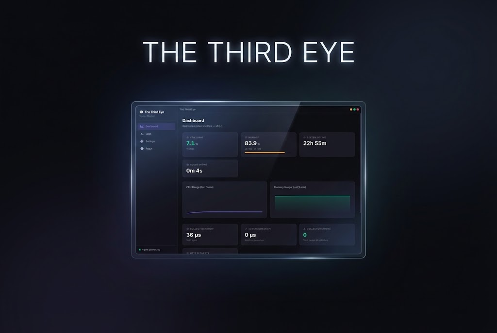

<p align="center">
  
</p>

# The Third Eye

Lightweight system monitoring agent for Windows with a desktop dashboard.  
Collects CPU, memory, system, and **per-process** metrics — exposes them via Prometheus and a local UI.

---

## Installation

### Prerequisites

- [CMake](https://cmake.org/download/) (>= 3.20)
- [MinGW-w64](https://www.mingw-w64.org/) or MSVC 2022+
- [Node.js](https://nodejs.org/) (>= 18)

> Don't worry — `build.bat` checks for these and tells you what's missing.

### Build

```
build.bat
```

This compiles the C++ agent and installs the UI dependencies.

### Run

```
start.bat
```

This starts the agent and opens the dashboard. Done.

---

## What You Get

- **Dashboard** — CPU, memory, uptime, health status, live sparklines, **top processes table**
- **Alerts** — threshold-based local anomaly detection (CPU > 90%, memory > 90%, slow collection)
- **Logs** — real-time agent logs with search and filtering
- **Settings** — change collection interval and log level on the fly
- **Diagnostics** — export a full snapshot (processes, alerts, metrics) for troubleshooting
- **Prometheus** — `http://127.0.0.1:9100/metrics`

---

## API

| Endpoint | Description |
|----------|-------------|
| `GET /metrics` | Prometheus text format |
| `GET /api/status` | Health, metrics, config, build info, top processes |
| `GET /api/logs` | Log entries (supports `?level=` and `?limit=`) |
| `GET /api/alerts` | Active alerts and alert history |
| `POST /api/config` | Update interval and log level at runtime |

---

## Configuration

| Flag | Default | Description |
|------|---------|-------------|
| `--port` | `9100` | HTTP port |
| `--interval` | `1` | Collection interval (seconds) |
| `--top-n` | `5` | Top N processes to track (max 10) |
| `--log-level` | `info` | `info` or `debug` |

---

## License

[MIT](LICENSE)
